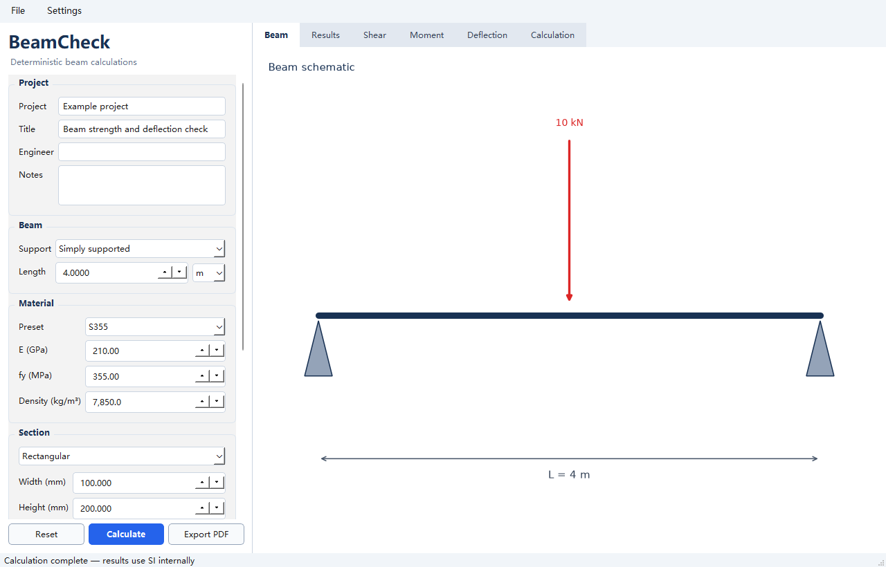
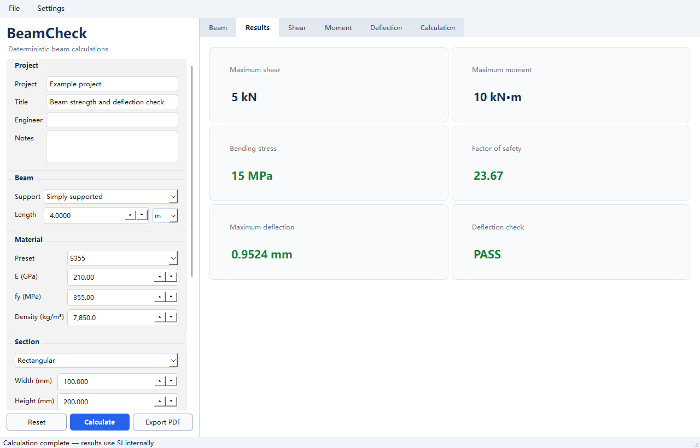

# BeamCheck

BeamCheck is a fast, offline beam strength and deflection calculator for Windows, designed for engineers who want transparent calculations without setting up spreadsheets or opening full FEA software.

**Windows · Offline · No login · No telemetry · Transparent calculations**

[Download and install](#download-and-install) · [Features](#features) · [Development](#development)

[](https://github.com/jordanyushen/BeamCheck/actions/workflows/tests.yml)


[](LICENSE)



BeamCheck covers common simply supported and cantilever beam checks. It reports reactions, shear force, bending moment, bending stress, and deflection from one consistent calculation result, with a calculation-details view that makes the inputs, assumptions, formulas, and units inspectable.

> **Engineering disclaimer:** BeamCheck is a calculation aid, not a substitute for qualified engineering judgment, applicable codes, independent verification, or project-specific review. Do not use its output as the sole basis for safety-critical decisions.

## Why BeamCheck?

| | Spreadsheet | Full FEA software | BeamCheck |
|---|---|---|---|
| Setup | Formula and unit setup is manual | Model, mesh, and solver setup | Guided beam inputs |
| Auditability | Depends on spreadsheet quality | Detailed, but often complex | Inputs, formulas, and units shown together |
| Speed for routine beam checks | Fast after a trusted sheet exists | Often excessive for a simple check | Immediate |
| Installation | Office suite or equivalent | Large specialist package | Portable Windows folder |
| Internet/account | Varies | Often required for licensing | Neither required |
| Scope | Flexible but easy to alter accidentally | Broad structural analysis | Intentionally limited to common beam cases |

## Download and install

BeamCheck targets 64-bit Windows 10 and Windows 11. The packaged application is distributed as a folder so its required runtime files stay together:

1. Download `BeamCheck-v0.1.0-windows-x64.zip` from [GitHub Releases](https://github.com/jordanyushen/BeamCheck/releases).
2. Extract the complete ZIP to a writable folder.
3. Run `BeamCheck.exe` inside the extracted `BeamCheck` folder.

The first public Windows binary is being prepared. Until it appears on the Releases page, use the [development setup](#development). GitHub's automatically generated source archives do **not** contain `BeamCheck.exe`.

Windows may show a SmartScreen warning for an unsigned first release. Confirm that the download came from this repository and verify the published checksum before running it. Do not move only the `.exe`; the adjacent files are required.

## Quick example

The default case is a simply supported beam with a centre point load. Open the app, confirm or edit the geometry, section, material, load, and acceptance criteria, then select **Calculate**. BeamCheck updates the result cards, diagrams, and detailed calculation from the same result.



Treat this example as a workflow demonstration, not a design recommendation. Always verify the selected model and units against the real structure.

## Features

### What it calculates

- Simply supported and cantilever beam cases
- One point load and/or one full-span uniformly distributed load in the desktop interface
- Support reactions, maximum shear, and maximum bending moment
- Elastic bending stress, yield factor of safety, and deflection
- PASS/FAIL checks against material yield strength and a selected deflection criterion
- Shear-force and bending-moment diagrams

### Sections, materials, and outputs

- Solid rectangular, solid circular, rectangular hollow, and square hollow section properties
- Built-in material presets with editable properties
- Calculation-detail view with formulas, substitutions, units, and assumptions
- PDF calculation report export
- Project save/load using JSON
- English, French, German, and Simplified Chinese interface languages

### Local-first operation

- Runs fully offline after installation
- No account, cloud service, or telemetry
- Input and project data remain on the computer unless the user exports or shares them

## Calculation transparency

BeamCheck uses one immutable solver result for the result cards, diagrams, detailed calculation, and PDF report. This reduces the risk of different views showing calculations made from different inputs.

The automated benchmark suite checks representative cases, including:

- Simply supported beam with a centre point load
- Simply supported beam with a full-span uniformly distributed load
- Cantilever with an end point load
- Cantilever with a full-length uniformly distributed load
- Section-property and unit-conversion checks

Benchmarks are useful regression checks, not independent certification. If a result matters to a real design, reproduce it using a trusted reference calculation and the applicable design standard.

## Assumptions and known limitations

- Small-deflection, linear-elastic Euler–Bernoulli beam behaviour
- Prismatic members with constant section and material properties
- Idealized supports and static loading
- No plasticity, buckling, lateral-torsional buckling, fatigue, vibration, connection, or stability design
- No automatic load combinations, code checks, partial factors, or jurisdiction-specific compliance
- No partial-span distributed loads; the desktop interface accepts at most one point load and one full-span distributed load
- Loads are treated as downward and non-negative
- The maximum deflection location is selected from dense numerical sampling that also includes load and moment-extremum positions
- Results are only as valid as the idealization, units, material properties, section properties, and acceptance criteria supplied by the user

## Development

### Run from source

Python 3.12 is recommended.

```powershell
git clone https://github.com/jordanyushen/BeamCheck.git
cd BeamCheck
python -m venv .venv
.\.venv\Scripts\python.exe -m pip install -r requirements.txt
.\.venv\Scripts\python.exe app.py
```

### Run tests

```powershell
.\.venv\Scripts\python.exe -m pytest -q
```

### Build the Windows application

```powershell
.\.venv\Scripts\python.exe -m PyInstaller --noconfirm --clean BeamCheck.spec
```

The one-folder build is written to `dist\BeamCheck`. Distribute the complete folder, normally as `BeamCheck-v0.1.0-windows-x64.zip`.

## Architecture

- `beamcheck/core/solver.py` — deterministic beam equations and load-case solving
- `beamcheck/core/sections.py` — section-property calculations and validation
- `beamcheck/core/materials.py` — built-in material data
- `beamcheck/core/units.py` — unit conversions
- `beamcheck/core/models.py` — typed input/result models and validation
- `beamcheck/reporting/` — formula trace and PDF report generation
- `beamcheck/gui/` — PySide6 desktop interface and plots
- `tests/` — benchmark and regression tests

The solver is kept separate from the UI so the engineering logic can be tested without driving the desktop application.

## Roadmap

- Publish and verify the first signed-off Windows release package
- Expand benchmark coverage and calculation-reference documentation
- Add more load arrangements while keeping assumptions explicit
- Improve accessibility and translated interface coverage

## Contributing

Bug reports, benchmark cases, documentation improvements, and carefully scoped engineering features are welcome. Read [CONTRIBUTING.md](CONTRIBUTING.md) before opening a pull request. Changes to calculation logic must include traceable formulas, references, assumptions, and regression tests.

## License

BeamCheck is released under the [MIT License](LICENSE).

## Disclaimer

BeamCheck is provided for preliminary calculation and educational support. It is not certified engineering software and does not determine compliance with any code or regulation. A qualified engineer remains responsible for model selection, loads, combinations, criteria, independent checks, and the final design.
